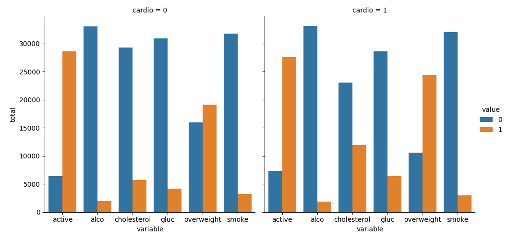
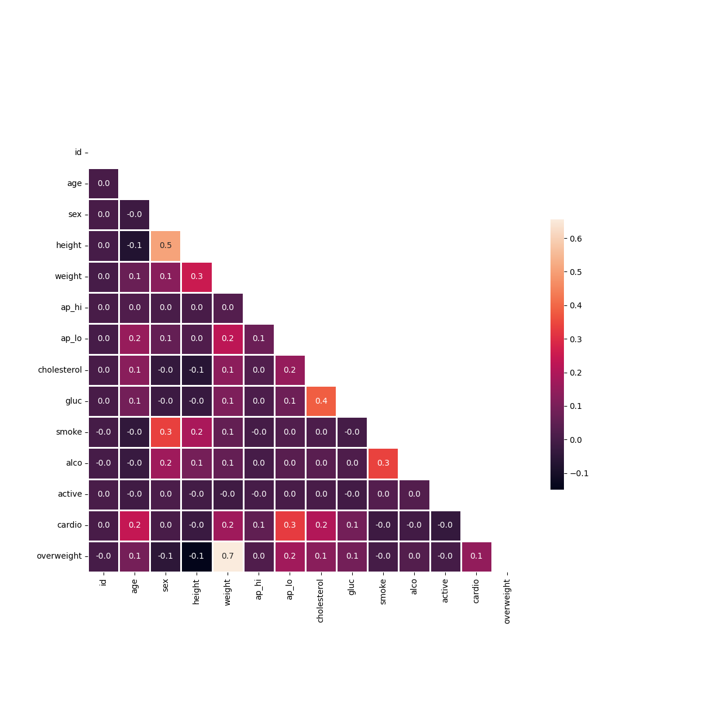

# Medical Data Visualizer

This is the boilerplate for the Medical Data Visualizer project. Instructions for building your project can be found at https://www.freecodecamp.org/learn/data-analysis-with-python/data-analysis-with-python-projects/medical-data-visualizer

## 1. Gráfico Categórico
Este gráfico mostra a distribuição de variáveis como `active`, `alco`, `cholesterol`, `gluc`, `overweight` e `smoke` para pacientes com e sem doença cardiovascular (`cardio`). Os valores `0` e `1` representam as diferentes categorias dentro de cada variável.

## 2. Matriz de Correlação (Heatmap)
O heatmap visualiza a correlação entre todas as variáveis do conjunto de dados. Uma máscara foi aplicada para mostrar apenas a metade inferior da matriz, evitando informações redundantes. Os valores mais próximos de 1.0 (ou -1.0) indicam uma correlação mais forte.

